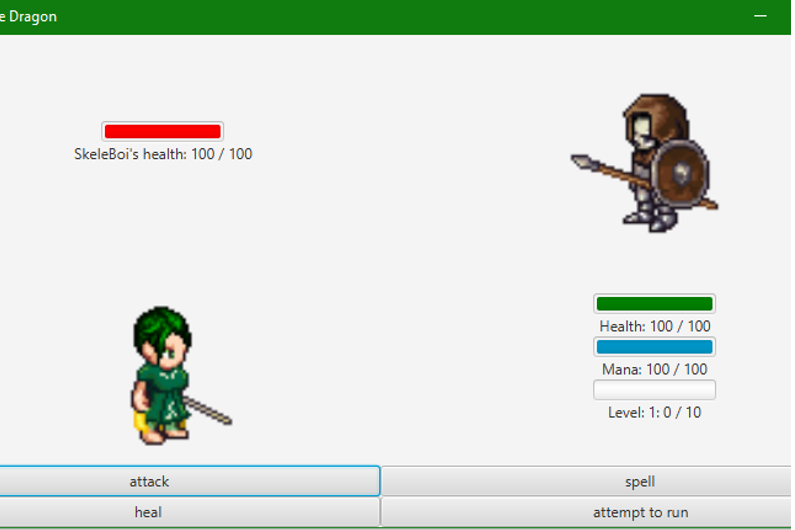
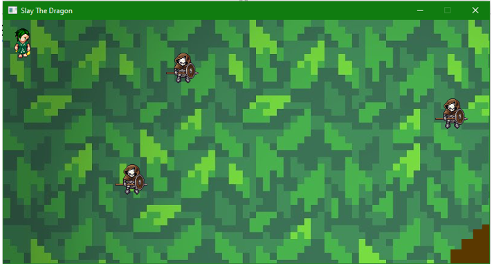

# Java-Turn-based-RPG
This is pokemon-like turn based game that features three levels. I have implemented three different boss logics accordingly. 
Built out Character, Movement, Animation and Music classes using JavaFX libraries.
# Screenshots

Overworld screen
